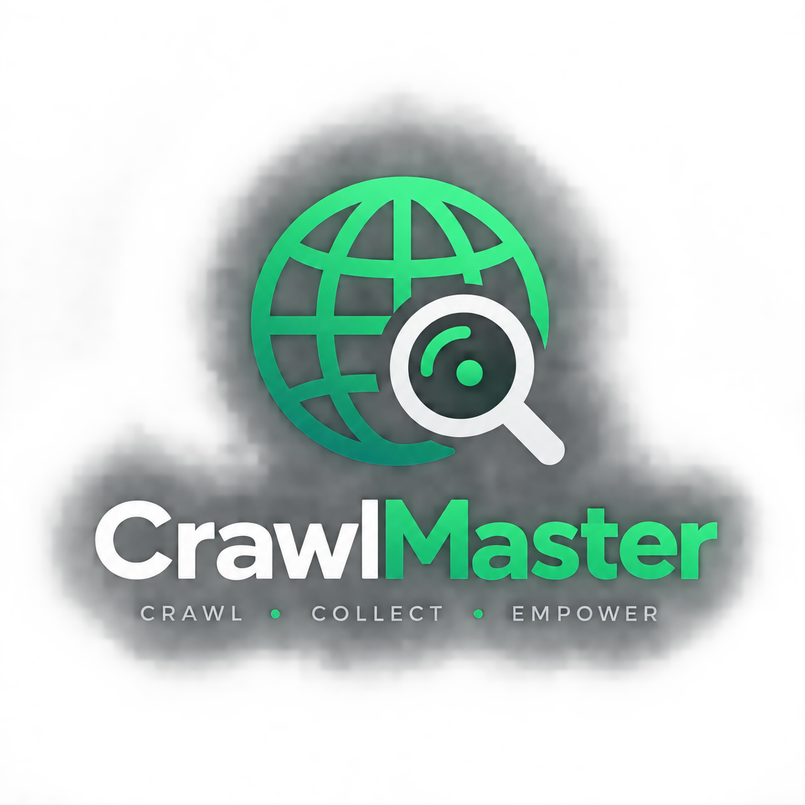

# CrawlMaster

<p align="center">
  
</p>

CrawlMaster is a Python website crawler with a FastAPI dashboard. It supports full-site content crawling, legacy IT-job extraction, report browsing, recurring schedules, settings management, task monitoring, and cooperative crawl cancellation.

## Current system

The project has two execution modes:

1. **CLI crawler** — crawl a website from the terminal and write Markdown/JSON output.
2. **Web dashboard** — start and monitor crawls, inspect reports, manage schedules, and update crawler defaults.

The crawler uses a six-stage fallback pipeline:

| Stage | Fetch strategy |
|---|---|
| 1 | Crawl4AI / headless browser |
| 2 | Scrapling / browser and stealth fetching |
| 3 | Jina Reader proxy |
| 4 | curl-cffi TLS impersonation |
| 5 | curl-cffi rotated profiles |
| 6 | Plain HTTPX |

## Architecture

```text
CLI / Dashboard
      |
      v
FastAPI API + lifespan scheduler
      |
      +-- TaskManager -------- data/tasks.json
      +-- ScheduleManager ---- data/schedules.json
      +-- SettingsManager ---- data/settings.json
      +-- ReportManager ------ output/<domain>/
      +-- CancellationRegistry / WorkerRegistry
      |
      v
CrawlOrchestrator
      |
      +-- robots and sitemap discovery
      +-- navigation and link discovery
      +-- concurrent page queue
      +-- content/contact/meta extraction
      +-- Markdown, JSON, summary exports
```

## Repository structure

```text
Crawler/
├── .gitignore                      Ignore rules for local/generated files
├── main.py                         CLI and dashboard entry point
├── requirements.txt                Runtime and test dependencies
├── pytest.ini                      Pytest configuration
├── backend/                        Python application package
│   ├── api/                        FastAPI routes and worker lifecycle
│   ├── core/                       Config, models, and fallback pipeline
│   ├── crawler/                    Queue, orchestration, and checkpoints
│   ├── discovery/                  Robots, sitemaps, links, and navigation
│   ├── extraction/                 Content, contacts, metadata, and jobs
│   ├── exporters/                  Markdown and JSON exporters
│   ├── services/                   Tasks, schedules, settings, reports,
│   │                               storage, cancellation, and URL validation
│   └── stages/                     Individual fetch implementations
├── frontend/                       Static dashboard UI
│   ├── pages/                      Dashboard HTML pages
│   ├── scripts/                    Page and shared JavaScript
│   ├── styles/styles.css           Shared dashboard styles
│   └── assets/logo.png             Dashboard logo
├── tests/                          Pytest test suite
│   ├── conftest.py                 Shared test configuration
│   └── test_*.py                   Unit and service tests
├── docs/                           Project plans and implementation reports
│   ├── plans/
│   │   ├── implementation_plan.md  Detailed implementation plan
│   │   └── execution_plan.md       Current execution sequence
│   └── reports/
│       ├── IMPLEMENTATION_SUMMARY.md
│       ├── IMPLEMENTATION_AUDIT_AND_FIXES.md
│       └── REMAINING_WORK_ENVIRONMENTS.md
```

The following paths are created locally at runtime and are intentionally excluded
from GitHub:

```text
├── data/                           Task, schedule, settings, and checkpoints
├── output/                         Generated crawl reports
├── crawl_state.json                CLI checkpoint state
├── venv/                           Local Python virtual environment
└── .pytest_cache/                  Local pytest cache
```

## Installation

```powershell
python -m venv venv
.\venv\Scripts\Activate.ps1
pip install -r requirements.txt
```

For browser-based stages, install the browser runtime if required:

```powershell
crawl4ai-setup
```

## CLI usage

### Universal website crawl

```powershell
python main.py https://example.com
python main.py https://example.com --max-pages 100 --max-depth 3
python main.py https://example.com --max-time 10 --concurrent 5 --delay 0.5
python main.py https://example.com --resume
python main.py https://example.com --format json
```

Important universal options:

| Option | Default | Meaning |
|---|---:|---|
| `--max-pages` | `200` | Maximum successfully crawled pages |
| `--max-discovered-urls` | `1000` | Maximum discovered/enqueued URLs |
| `--max-depth` | `5` | Maximum link depth |
| `--max-time` | `30` | Time budget in minutes |
| `--delay` | `1.5` | Delay between request starts |
| `--concurrent` | `3` | Concurrent page workers |
| `--no-robots` | off | Ignore robots.txt restrictions |
| `--resume` | off | Resume a checkpoint |
| `--output` | `./output` | Report output directory |
| `--format` | `markdown json` | Output formats |

### Legacy IT job mode

```powershell
python main.py https://company.example/careers --mode jobs
python main.py https://company.example/careers --mode jobs --all-jobs
python main.py https://company.example/careers --mode jobs --jobs-output json
python main.py https://company.example/careers --mode jobs --disable-browser
python main.py https://company.example/careers --mode jobs --jina-key YOUR_KEY
```

## Dashboard

Start the dashboard:

```powershell
python main.py --mode server
```

Open `http://localhost:8000`.

| Route | Purpose |
|---|---|
| `/` | Start crawls and view dashboard statistics |
| `/crawls` | Filter tasks, inspect status, cancel, and re-run crawls |
| `/reports` | Browse reports, pages, contacts, SEO, and downloads |
| `/schedules` | Create, edit, delete, and run one-time scheduled crawls |
| `/settings` | Configure crawler defaults, stages, theme, and maintenance |

## Crawl lifecycle and cancellation

Dashboard crawls receive a task ID. Task metadata is persisted to `data/tasks.json`, while active worker and cancellation state are held by the server process.

Task states include:

```text
Queued
Running
CancellationRequested
Cancelled
Completed
Failed
```

Cancel a task:

```text
POST /api/tasks/{task_id}/cancel
```

Cancellation is cooperative. The cancellation event stops queue expansion and new page work at orchestrator checkpoints. A third-party browser or network operation already in progress may continue until its timeout.

Deleting an active schedule requires cancellation:

```text
DELETE /api/schedules/{schedule_id}?cancel_active=true
```

The response may be `202` while the active crawl is stopping.

## Runtime data and outputs

Runtime data is ignored by Git through `data/` in `.gitignore`.

```text
data/
├── tasks.json                 Task history and request snapshots
├── schedules.json             Recurring schedule definitions
├── settings.json              Local crawler/UI settings
└── checkpoints/
    └── <task_id>.json         Task-specific crawl checkpoints
```

The dashboard uses task-specific checkpoints. The standalone CLI still uses the legacy root `crawl_state.json` path unless a custom checkpoint path is supplied.

Completed reports are published under:

```text
output/<domain>/
├── data.json                  Full WebsiteReport export
├── report.md                  Human-readable report
└── summary.json               Lightweight listing metadata
```

Temporary report directories use `_tmp_<task_id>`. Cancelled crawls should not replace a previous completed report.

## API summary

### Tasks and crawls

```text
POST   /api/crawl
GET    /api/tasks
GET    /api/tasks/{task_id}
GET    /api/status/{task_id}
POST   /api/tasks/{task_id}/cancel
POST   /api/tasks/{task_id}/rerun
DELETE /api/tasks/{task_id}
```

### Reports

```text
GET    /api/reports
GET    /api/reports/{domain}
GET    /api/reports/{domain}/pages?offset=0&limit=25&query=
GET    /api/reports/{domain}/download?format=json|markdown|csv
DELETE /api/reports/{domain}
```

### Schedules

```text
GET    /api/schedules
POST   /api/schedules
PUT    /api/schedules/{schedule_id}
DELETE /api/schedules/{schedule_id}
POST   /api/schedules/{schedule_id}/toggle
POST   /api/schedules/{schedule_id}/run-now
```

### Settings and maintenance

```text
GET    /api/settings
PUT    /api/settings
POST   /api/settings/reset
GET    /api/system/storage
POST   /api/system/clear-checkpoint
DELETE /api/system/checkpoints/{task_id}
```

## Testing

Run tests from the activated virtual environment:

```powershell
pytest tests/ -v
```

Compile-check the backend and tests:

```powershell
python -m compileall -q backend tests
```

Current tests cover basic atomic JSON storage, schedule claiming, and unsafe URL rejection. More integration coverage is required for cancellation, worker shutdown, report publication, checkpoint isolation, SSRF redirects/DNS rebinding, frontend safety, and authentication.

## Security and deployment notes

- The dashboard is intended for local use. The `main.py --mode server` launcher currently binds Uvicorn to `0.0.0.0`; restrict this before using it on an untrusted network, or change the host to `127.0.0.1`.
- Do not commit `data/`, `output/`, checkpoints, task history, schedules, settings, or API keys.
- URL validation blocks unsupported schemes and common private/loopback destinations. Redirect and DNS-rebinding protection still requires verification before exposing the service to untrusted users.
- Cancellation is cooperative and depends on finite network/browser timeouts.
- The scheduler is an in-process scheduler and should be treated as single-process unless a durable scheduler or queue is introduced.

## Current limitations

- Full cancellation behavior inside every third-party network/browser stage is still being completed.
- Redirect and DNS-rebinding SSRF protection requires additional verification.
- The Crawls page still has task log/options UI work remaining.
- No authentication or authorization layer is currently included.
- Runtime smoke testing requires installed project dependencies.

## License

No license has been specified. This project is currently intended for personal or internal use.
