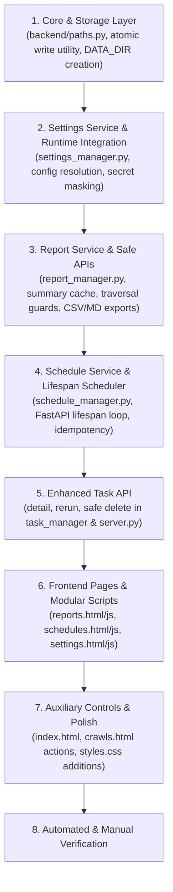

# Implementation Plan — Enabling Disabled Pages & Features in CrawlMaster

This implementation plan details how to fully enable the currently disabled pages (**Reports**, **Schedules**, and **Settings**) as well as disabled auxiliary controls in the CrawlMaster web dashboard. For every page, this document outlines the exact data sources, persistence layer, backend API contracts, security controls, and user interface specifications.

---

## 1. Overview of Disabled Pages & Features

Currently, the sidebar navigation and UI have several disabled or placeholder elements:
1. **Reports (`/reports`)** — Currently an empty 0-byte file (`reports.html`); links have `href="#"` or trigger `alert('This page is under construction.')`.
2. **Schedules (`/schedules`)** — Currently an empty 0-byte file (`schedules.html`); links have `href="#"` or trigger `alert()`.
3. **Settings (`/settings`)** — Currently an empty 0-byte file (`settings.html`); links have `href="#"` or trigger `alert()`.
4. **Auxiliary Disabled Features**:
   - Dashboard **"View Analytics"** button (topbar in [index.html](file:///d:/YT/Crawler/frontend/index.html)).
   - Crawls table **"View Logs"** and **"More Options"** buttons in [crawls.html](file:///d:/YT/Crawler/frontend/crawls.html).
   - Sidebar **Quick Actions** ("New Crawl", "Import URLs") and **"Crawl Credits"** quota card.

```mermaid
flowchart TD
    subgraph Frontend Pages
        DASH[Dashboard: /]
        CRAWLS[Crawls: /crawls]
        REPORTS[Reports: /reports - reports.js]
        SCHED[Schedules: /schedules - schedules.js]
        SETT[Settings: /settings - settings.js]
    end

    subgraph Backend API [backend/api/server.py]
        API_TASKS[/api/tasks]
        API_CRAWL[/api/crawl]
        API_REPORTS[/api/reports]
        API_SCHED[/api/schedules]
        API_SETT[/api/settings]
        API_SYS[/api/system]
    end

    subgraph Core & Storage Layer
        DATA_INIT[DATA_DIR & OUTPUT_DIR Initialization]
        ATOMIC_IO[Atomic JSON Storage helper]
        TASKS_STORE[(data/tasks.json)]
        OUTPUT_STORE[(output/<domain>/data.json & report.md)]
        SCHED_STORE[(data/schedules.json)]
        SETT_STORE[(data/settings.json)]
        CHECKPOINT[(crawl_state.json - root)]
        CORE_CONFIG[backend/core/config.py]
        LIFECYCLE_SCHED[Lifespan Asyncio Scheduler Loop]
    end

    REPORTS --> API_REPORTS --> OUTPUT_STORE
    SCHED --> API_SCHED --> SCHED_STORE
    SCHED_STORE --> LIFECYCLE_SCHED --> API_CRAWL
    SETT --> API_SETT --> SETT_STORE
    SETT_STORE -. defaults .-> CORE_CONFIG
    API_CRAWL -. reads effective config .-> SETT_STORE
    DASH --> API_TASKS --> TASKS_STORE
    CRAWLS --> API_TASKS
```

---

## 2. Shared Storage, Paths & Atomic I/O Architecture

To ensure reliability across cold starts and prevent file corruption during crashes or restarts:
1. **Directory Initialization**:
   - Define `DATA_DIR = PROJECT_ROOT / "data"` in [backend/paths.py](file:///d:/YT/Crawler/backend/paths.py).
   - Define `SCHEDULES_FILE = DATA_DIR / "schedules.json"`.
   - Define `SETTINGS_FILE = DATA_DIR / "settings.json"`.
   - The server and all managers ensure `DATA_DIR.mkdir(parents=True, exist_ok=True)` and `OUTPUT_DIR.mkdir(parents=True, exist_ok=True)` run on startup.
2. **Checkpoint Consistency**:
   - `CHECKPOINT_FILE` is defined as `PROJECT_ROOT / "crawl_state.json"`.
   - System maintenance endpoints and crawler routines strictly reference `backend.paths.CHECKPOINT_FILE` rather than hardcoding paths.
3. **Atomic File Writes**:
   - All JSON stores (`tasks.json`, `schedules.json`, `settings.json`) use an atomic write utility (`write_json_atomic(filepath, data)`): writes to a temporary file (`filepath.with_suffix('.tmp')`) followed by an atomic `os.replace` to prevent corrupted partial writes.

---

## 3. Page 1: Reports (`/reports` & `reports.html`)

### 3.1 Purpose & Feature Scope
The **Reports Page** acts as an interactive archive and data explorer for all completed crawls. Instead of viewing raw JSON or static Markdown in a text editor, users can:
- Browse all crawled domains with aggregate metrics (pages crawled, words, emails, images, crawl duration).
- Filter and search reports by domain name, crawl date, or tags.
- Open an **Interactive Report Explorer**:
  - **Executive Summary**: Crawl health, status codes, top-level stats.
  - **Extracted Intelligence**: All contact info (emails, phone numbers, addresses, social profiles) with 1-click clipboard copy.
  - **Pages Explorer**: Searchable list of all crawled URLs, HTTP status, word counts, depth level, and meta title/description.
  - **SEO & Structured Data**: Open Graph tags, canonical URLs, JSON-LD schemas extracted.
  - **Media Gallery / Table**: Discovered images and media URLs.
  - **Download Center**: 1-click download of `report.md`, `data.json`, and an on-the-fly generated CSV summary (one row per page or site summary).
- Delete domain reports with active-crawl locking.

### 3.2 Where the Data Comes From
The data for this page already exists or will be generated directly by the crawler engine:
1. **Primary Raw Data Source**:
   - Directory: [output/](file:///d:/YT/Crawler/output/)
   - For every completed crawl, the crawler outputs:
     - `output/<domain>/data.json` — A serialized [WebsiteReport](file:///d:/YT/Crawler/backend/core/models.py#L133-L169) object containing:
       - `domain`, `base_url`, `site_title`, `platform`, `language`
       - `crawl_started`, `crawl_finished`, `crawl_stopped_reason`
       - `total_urls_found`, `total_pages_crawled`, `failed_pages`, `total_words`, `total_images`
       - `pages`: Array of [PageData](file:///d:/YT/Crawler/backend/core/models.py#L87-L131) (headings, paragraphs, tables, images, emails, phones, social links, meta SEO)
       - `all_emails`, `all_phones`, `all_addresses`, `social_media`
       - `failed_urls`, `external_links`
     - `output/<domain>/report.md` — Formatted Markdown report generated by [generate_markdown_report()](file:///d:/YT/Crawler/backend/exporters/markdown_report.py).
     - `output/<domain>/summary.json` — Small listing index generated atomically with the completed report and containing only stable summary fields.
2. **Metadata Cross-Reference**:
   - [data/tasks.json](file:///d:/YT/Crawler/data/tasks.json) provides task IDs, original URLs, and status history to link tasks to domain reports.

### 3.3 Scalable Report Reader & Path Traversal Guard
- **Summary vs. Detail Loading**:
  - To prevent out-of-memory or high latency when listing reports, `ReportManager.get_all_reports_summary()` reads the small generated `summary.json` file. For legacy report folders without `summary.json`, use a bounded compatibility fallback and cache the result by `data.json` modification time; do not describe ordinary full-file JSON parsing as lightweight.
- **Path Traversal Protection**:
  - Any `{domain}` input is validated via regex (`^[a-zA-Z0-9.-]+$`) and resolved against `OUTPUT_DIR`.
  - The resolved path must satisfy `resolved_path.is_relative_to(OUTPUT_DIR.resolve())`. Invalid or traversal requests immediately return `400 Bad Request` or `404 Not Found`.
- **Concurrency & Deletion Guard**:
  - Deleting a report verifies that no active task in `tasks.json` has `status == "Running"` with a matching domain.

### 3.4 Backend API Endpoints Needed
- `GET /api/reports` — List lightweight summary records of all reports.
- `GET /api/reports/{domain}` — Fetch full report details for the interactive explorer.
- `GET /api/reports/{domain}/download?format=markdown|json|csv` — Stream/download file attachments (`report.md`, `data.json`, or generated `pages.csv`).
- `DELETE /api/reports/{domain}` — Safely delete the report folder if not currently being crawled.

---

## 4. Page 2: Schedules (`/schedules` & `schedules.html`)

### 4.1 Purpose & Feature Scope
The **Schedules Page** enables recurring, unattended crawls (e.g. daily site audit, weekly competitor monitoring, monthly content index). Users can:
- View all scheduled crawl jobs (URL, recurrence rule, next run countdown, last run status).
- Toggle schedules active/paused with a switch.
- Trigger "Run Now" to initiate an instant crawl outside the schedule.
- Create / Edit / Delete schedules with configurable frequency (Daily, Weekly, Monthly, or Custom Cron) and crawler limits (max pages, depth, concurrency, ignore robots).
- View schedule execution history.

### 4.2 Where the Data Comes From
1. **Persistent Data Storage**:
   - Location: `data/schedules.json` (managed via atomic writes).
   - Managed by: `ScheduleManager` in [backend/services/schedule_manager.py](file:///d:/YT/Crawler/backend/services/schedule_manager.py).
   - Schema per schedule item:
     ```json
     {
       "id": "sched_9f3b81a2",
       "name": "Kariyan Weekly Sync",
       "url": "https://www.kariyan.de/",
       "enabled": true,
       "frequency": "weekly",
       "cron_expr": "0 2 * * 1",
       "config": {
         "max_pages": 150,
         "max_depth": 3,
         "concurrent": 3,
         "delay": 1.5,
         "no_robots": false
       },
       "created_at": "2026-09-23T10:00:00Z",
       "last_run_at": "2026-09-22T02:00:00Z",
       "last_run_status": "Completed",
       "last_task_id": "8875f19d-0636-4f08-9042-1d4d9f061af2",
       "next_run_at": "2026-09-29T02:00:00Z"
     }
     ```
2. **Scheduling Engine & Single-Process Execution**:
   - Runs as a clean `asyncio` background task inside FastAPI's **Lifespan Context** (`lifespan(app)`).
   - Avoids external dependencies (like unpinned `APScheduler`) while providing reliable periodic checks (every 60s).
   - Features:
     - Asynchronous cancellation handle / `asyncio.Event` stop signal on server shutdown.
     - **Idempotency & Claim Lock**: Atomically claims due schedules (`next_run_at <= now`), updates `last_run_at`, computes `next_run_at`, and prevents duplicate execution if a previous scheduled run is still active.
     - Dispatches crawl via `background_crawl_task` and records `last_task_id`.

### 4.3 Backend API Endpoints Needed
- `GET /api/schedules` — List all schedules.
- `POST /api/schedules` — Create a new schedule (with URL, frequency, and config validation).
- `PUT /api/schedules/{id}` — Update schedule configuration or frequency.
- `DELETE /api/schedules/{id}` — Delete a schedule.
- `POST /api/schedules/{id}/toggle` — Toggle active/paused state.
- `POST /api/schedules/{id}/run-now` — Immediately enqueue a task for this schedule.

---

## 5. Page 3: Settings (`/settings` & `settings.html`)

### 5.1 Purpose & Feature Scope
The **Settings Page** allows users to customize default crawl parameters, toggle pipeline stages, enter external API keys, manage storage, and configure UI preferences:
- **Crawler Defaults**: Default max pages (200), max depth (5), concurrency (3), request delay (1.5s), timeout budget (30m), robots.txt policy.
- **Pipeline Stage Toggles**: Enable/disable specific stages (Crawl4AI, Scrapling, Jina Reader, curl_cffi TLS impersonation, curl_cffi rotated, httpx fallback).
- **External API Keys**: Jina Reader API key with secret redaction (`has_key: true`, value masked as `••••••••`).
- **Storage & System Maintenance**:
  - View disk usage of `output/` and `data/`.
  - "Clear Checkpoint" button (resets root `crawl_state.json` defined in `backend.paths.CHECKPOINT_FILE`).
  - "Clean Orphaned Tasks" (reconciles completed tasks with existing reports).
- **Application Preferences**: Default theme (Light / Dark / System), dashboard auto-refresh polling intervals (2s / 5s / 10s / Off).

### 5.2 Where the Data Comes From & Precedence Rules
1. **Persistent Data Storage**:
   - Location: `data/settings.json` (managed via atomic writes).
   - Managed by: `SettingsManager` in `backend/services/settings_manager.py`.
2. **Fallback / Ground Truth**:
   - [backend/core/config.py](file:///d:/YT/Crawler/backend/core/config.py): [CrawlerConfig](file:///d:/YT/Crawler/backend/core/config.py#L109) and [PipelineConfig](file:///d:/YT/Crawler/backend/core/config.py#L9) supply factory defaults.
3. **Runtime Precedence**:
   - For all crawls (both manual via `/api/crawl` and scheduled via `ScheduleManager`), configuration resolution follows strict precedence:
     $$\text{Explicit Request Overrides} > \text{Saved User Settings} (\text{data/settings.json}) > \text{Code Defaults}$$
   - The crawl runner passes the resolved `PipelineConfig` directly into `CrawlOrchestrator(pipeline_config=...)`, ensuring stage toggles, timeout, and Jina API keys are honored end-to-end.
4. **Secret Redaction**:
   - `GET /api/settings` redacts sensitive fields like `jina_api_key` (`has_jina_key: bool`, masked placeholder `sk-••••••••`).
   - When updating settings, if the masked placeholder is sent back, the existing saved secret is retained.

### 5.3 Backend API Endpoints Needed
- `GET /api/settings` — Returns the current configuration (with secrets masked) merged with defaults.
- `PUT /api/settings` — Validates and persists settings to `data/settings.json`.
- `POST /api/settings/reset` — Resets settings to factory defaults.
- `GET /api/system/storage` — Returns storage footprint (output reports count, disk size in MB, checkpoint state).
- `POST /api/system/clear-checkpoint` — Removes root `crawl_state.json`.

---

## 6. Auxiliary Features & Enhanced Task API

1. **Dashboard "View Analytics" Button** ([index.html](file:///d:/YT/Crawler/frontend/index.html#L93)):
   - Route directly to `/reports` with aggregate analytics metrics.
2. **Complete Task API & Crawls Table Actions**:
   - `GET /api/tasks/{task_id}`: Returns full metadata for a task, including failure reasons, runtime duration, and linked report domain.
   - `POST /api/tasks/{task_id}/rerun`: Reruns a completed/failed crawl with identical parameters.
   - `DELETE /api/tasks/{task_id}`: Deletes task entry (with safeguard against deleting active crawls).
   - In [crawls.html](file:///d:/YT/Crawler/frontend/crawls.html):
     - Replace display-only "View Logs" with a slide-over drawer showing detailed task execution log / metadata.
     - Replace "More Options" with a popover menu ("View Report", "Re-run Crawl", "Delete Task").
3. **Sidebar Quick Actions & Nav Links**:
   - Connect sidebar navigation links across all pages (`/`, `/crawls`, `/schedules`, `/reports`, `/settings`).
   - Replace generic placeholder blocker in `app.js` with isolated, page-specific modules.

---

## 7. Modular Frontend Architecture

To avoid monolithic script issues and prevent placeholder event listeners from blocking real interactive elements, each page receives its own modular frontend script:
- [frontend/reports.html](file:///d:/YT/Crawler/frontend/reports.html) + `frontend/reports.js`: Reports table, search/filter, full-screen report inspection drawer, export downloads.
- [frontend/schedules.html](file:///d:/YT/Crawler/frontend/schedules.html) + `frontend/schedules.js`: Schedule management table, modal dialog, pause/resume switches, instant execution.
- [frontend/settings.html](file:///d:/YT/Crawler/frontend/settings.html) + `frontend/settings.js`: Tabbed configuration views, secret unmasking toggle, cache clearing, toast feedback.
- Shared utilities (`theme`, `navigation`, `toast`) loaded gracefully with defensive null-checks.

---

## 8. Plan Review Findings and Architecture Verification

All findings from the architectural review have been verified against the codebase and integrated into the design:

| Finding | Repository Reality | Architecture Decision |
|---|---|---|
| **8.1 Checkpoint Location** | `backend/paths.py` defines `CHECKPOINT_FILE = PROJECT_ROOT / "crawl_state.json"`. | Use `CHECKPOINT_FILE` constant everywhere; do not use `data/crawl_state.json`. |
| **8.2 Storage Initialization & Atomic Writes** | `data/` directory was not auto-created; non-atomic writes could corrupt on crash. | Add `DATA_DIR` in `backend/paths.py`, ensure directories are created on boot, use atomic `.tmp` + `os.replace` writes. |
| **8.3 Report Scalability & Contracts** | Full `data.json` files can exceed 3MB; listing would degrade performance. | Implement fast summary parsing (top-level fields only) and separate detail route; define explicit CSV schema. |
| **8.4 Path Traversal Protection** | Domain parameter could be abused (`../../`). | Strict domain regex validation and path resolution guard (`is_relative_to(OUTPUT_DIR)`). |
| **8.5 Runtime Settings Precedence** | `server.py` previously hardcoded `PipelineConfig(timeout=30)`. | Implement precedence: Request > Settings > Defaults. Wire settings into `CrawlOrchestrator`. Mask secrets. |
| **8.6 Pipeline Toggles Validation** | Orchestrator forwards `pipeline_config` to `CrawlPipeline`. | Only expose tested stages (Crawl4AI, Scrapling, Jina, curl_cffi, HTTPX); test stage disablement. |
| **8.7 Single-Process Scheduler** | `APScheduler` not installed; background tasks must not duplicate on reload. | Use FastAPI Lifespan `asyncio` task loop with stop event, execution lock, and persisted execution state. |
| **8.8 Schedule Idempotency & Validation** | Server restart could re-trigger crawl if `next_run_at <= now`. | Validate schedule input; atomically claim run slot; update next run timestamp before dispatch. |
| **8.9 Task API Completeness** | UI requires detail, re-run, and delete capabilities. | Implement `GET /api/tasks/{id}`, `POST /api/tasks/{id}/rerun`, `DELETE /api/tasks/{id}`. |
| **8.10 Deletion Safety & Concurrency** | Deleting active reports/tasks causes partial files. | Reject deletion if associated crawl is in `Running` status. |
| **8.11 Frontend Script Separation** | `app.js` contained broad selectors blocking nav. | Create separate `reports.js`, `schedules.js`, `settings.js` with explicit handlers and empty/error states. |
| **8.12 Test Fixtures** | Tests shouldn't rely on existing `kariyan.de`. | Use temporary directories and synthetic mock reports/schedules for unit tests. |

---

## 9. Step-by-Step Implementation Sequence



---

## 10. Verification & Testing Plan

### Automated / API Verification
1. **Storage & Startup Test**:
   - Test server startup in an environment with missing `data/` and `output/` directories; verify they are automatically created.
2. **Security & Path Traversal Test**:
   - Send `GET /api/reports/..%2f..%2fetc` and verify it is rejected with `400` or `404`.
3. **Settings & Precedence Test**:
   - Save custom settings via `PUT /api/settings`.
   - Verify `GET /api/settings` masks `jina_api_key`.
   - Verify crawl runner honors custom settings when no request overrides are supplied.
4. **Schedule Idempotency & Execution Test**:
   - Create a test schedule; execute schedule tick; verify task is created in `tasks.json` and `next_run_at` advances.
   - Verify second tick while task is running does not spawn duplicate crawls.
5. **Report Summary & Detail Test**:
   - Write a synthetic `data.json` report in a temp output dir; verify `GET /api/reports` returns summary and `GET /api/reports/{domain}` returns full structure.
   - Verify CSV export streams valid CSV headers and rows.

### Manual / Browser Verification
1. **Navigation**: Click through all 5 sidebar items (`Dashboard`, `Crawls`, `Schedules`, `Reports`, `Settings`) across both Light and Dark themes.
2. **Reports UI**:
   - Inspect the existing `kariyan.de` report in the interactive drawer.
   - Test search filter by domain name.
   - Test 1-click clipboard copy for emails/phones.
   - Test download buttons for Markdown and JSON.
3. **Schedules UI**:
   - Create a new schedule via the modal.
   - Toggle status (Active / Paused).
   - Click "Run Now" and observe crawl starting in `/crawls`.
4. **Settings UI**:
   - Adjust concurrency and default max pages.
   - Click "Save Changes" and observe toast confirmation.
   - Refresh page to verify values persist.
   - Test "Clear Checkpoint" button and verify status feedback.

---

## 11. Final Technical Corrections Before Implementation

The following details close the remaining implementation gaps identified during review.

### 11.1 Use genuinely lightweight report summaries

Calling `json.load()` still loads the complete `data.json` into memory, even when only summary fields are needed. The report list endpoint must not depend on parsing large page arrays on every request.

**Solution:** Generate a small `summary.json` beside each completed report during export and use it for `GET /api/reports`. For existing reports without `summary.json`, use a temporary compatibility fallback with cached results keyed by file modification time. Keep full `data.json` loading limited to the detail endpoint.

### 11.2 Make atomic writes safe under concurrent writers

A shared fixed `.tmp` filename can collide when two requests or background operations write the same JSON store at once. Atomic replacement prevents partial files, but does not serialize competing updates.

**Solution:** Add a per-file process lock around the complete read-modify-write operation and use a unique temporary filename in the same directory before `os.replace`. Apply this to tasks, schedules, and settings. If multi-process deployment is later supported, replace the in-process lock with a durable locking or database strategy.

### 11.3 Keep scheduler work off the event loop

`background_crawl_task()` is synchronous and calls `asyncio.run()`. Calling it directly from the async scheduler loop would block schedule checks and graceful shutdown while a crawl runs.

**Solution:** Dispatch the wrapper using `asyncio.to_thread(background_crawl_task, task_id, request)` or use a bounded worker executor. Track the returned future/task so shutdown can stop scheduling new work and wait for or explicitly cancel active schedule dispatches.

### 11.4 Persist the complete crawl request for re-runs

The current task record stores the URL but not crawl settings. A re-run cannot therefore reproduce the original crawl configuration.

**Solution:** Store a validated `request_config` object on every task, including max pages, depth, timeout, delay, concurrency, robots policy, and any effective pipeline settings. `POST /api/tasks/{task_id}/rerun` must create a new task using that snapshot, while allowing an explicit override if the API supports one.

### 11.5 Track report identity explicitly

Report deletion and task/report linking cannot reliably depend on deriving a domain later from the original URL. Multiple URL forms may normalize differently, and the current task model has no report reference.

**Solution:** Store `report_domain` or a generated `report_id` on the task after successful export. Use the same normalized identifier for report locking, “View Report,” orphan cleanup, and deletion checks. Define the behavior when multiple crawls produce the same domain output; preferably use a crawl/report ID or a versioned output directory rather than allowing concurrent writes to `output/<domain>`.

### 11.6 Clarify secret redaction and the UI toggle

An API that always redacts the Jina key cannot later reveal the saved value through a frontend “show” toggle. Returning the secret would weaken the redaction guarantee.

**Solution:** Keep `GET /api/settings` limited to `has_jina_key` and a masked placeholder. The show/hide control may reveal only the value currently typed in the form; it must not retrieve the stored secret. When the masked placeholder is submitted, retain the existing stored value. If secret retrieval is genuinely required, specify authentication and a separate audited reveal endpoint.

### 11.7 Lock schedule claims as one transaction

The scheduler’s “claim due schedule” operation must lock the read, eligibility check, next-run update, and persistence as one operation. Atomic replacement by itself does not prevent two scheduler calls from reading the same due schedule.

**Solution:** Put schedule claims behind the schedule-store lock, persist the advanced `next_run_at` and a run/claim ID before dispatching the crawl, and record a `dispatch_status` for failures. Ensure `Run Now` uses the same lock and cannot race with the periodic scheduler.

### 11.8 Protect same-domain output from concurrent crawls

Two manual or scheduled crawls for the same domain can write `output/<domain>/data.json` and `report.md` concurrently, producing mixed or truncated output.

**Solution:** Acquire a per-report/domain lock before writing output. Either reject a second active crawl with `409 Conflict`, or write each crawl to a temporary/versioned directory and atomically promote the completed directory. Add an automated test covering simultaneous same-domain crawls.

### 11.9 Add these cases to the verification checklist

Extend the automated tests with:

- Summary listing with a large report and no full-detail memory load.
- Concurrent writes to the same JSON store.
- Scheduler shutdown while a crawl is running.
- Re-run preserving the original request configuration.
- Task-to-report linking and orphan cleanup.
- Two scheduler ticks and `Run Now` racing for one schedule.
- Two crawls targeting the same domain.
- Confirmation that the settings API never returns the stored Jina key.

---

## 12. Final Consistency Corrections

### 12.1 Define schedule time zones and missed-run behavior

The schedule examples use UTC timestamps, but the user interface does not specify whether daily, weekly, monthly, and cron schedules run in UTC or local time. Daylight-saving transitions and downtime can otherwise produce surprising runs.

**Solution:** Store an explicit IANA time zone on every schedule (defaulting to UTC), calculate cron/recurrence values in that zone, and serialize timestamps as UTC. Define misfire behavior: skip missed runs, run once immediately, or catch up a bounded number of times. Test DST and server-restart cases.

### 12.2 Validate and bound every crawl and schedule parameter

The plan says “config validation” but does not specify limits. Unbounded pages, depth, concurrency, delay, timeout, or cron frequency could exhaust the process or create an accidental high-volume crawler.

**Solution:** Define Pydantic request models with minimum/maximum values, normalized URLs, allowed frequencies, maximum cron frequency, and a maximum number of schedules. Apply the same validation to manual requests, saved settings, schedule creation, and schedule updates. Never trust values loaded from existing JSON without revalidation.

### 12.3 Resolve advertised controls that have no endpoint

The overview advertises “Import URLs,” “Export All Data,” and “Clean Orphaned Tasks,” but the API section only specifies storage metrics and checkpoint clearing. These controls would otherwise remain placeholders.

**Solution:** Either remove them from the enabled feature scope or add explicit contracts: an import endpoint with file size/URL count limits and SSRF protections, an authenticated/streamed export endpoint, and a dry-run cleanup endpoint followed by an explicit commit action. Include tests for each. The recommended first release should disable Import URLs unless its security model is implemented.

### 12.4 Make report publication atomic, not only individual file writes

Writing `data.json`, `report.md`, and `summary.json` atomically one file at a time can still leave a mixed report if the process stops between files.

**Solution:** Write all outputs into a unique temporary crawl directory, validate them, then atomically rename/promote that directory as the active report. Keep the old report until promotion succeeds. Define the behavior when a report already exists and ensure readers ignore temporary directories.

### 12.5 Harden filesystem validation against symlinks

`is_relative_to()` protects normal `..` traversal, but filesystem symlinks can redirect a seemingly valid report directory outside `OUTPUT_DIR`.

**Solution:** Resolve both the base and target paths, reject symlinked report directories/files unless explicitly allowed, and re-check containment immediately before file access/deletion. Add a symlink escape test where supported.

### 12.6 Define frontend/API failure contracts

The plan mentions loading and error states but does not define response shapes or status handling. Frontend code may therefore treat validation errors and server failures as successful responses.

**Solution:** Use consistent FastAPI error responses (`detail`, optional field errors), documented status codes (`400`, `404`, `409`, `422`, `500`), and a shared frontend fetch helper that checks `response.ok`, parses errors, cancels stale requests, and displays retryable versus permanent failures.

### 12.7 Clarify local security assumptions

The dashboard currently has no authentication or authorization. The proposed settings, deletion, API-key, and crawler endpoints are destructive or sensitive if the server binds beyond localhost.

**Solution:** Bind to `127.0.0.1` by default and document that exposing the service requires authentication, HTTPS, and restricted CORS. Do not present destructive endpoints as production-safe until authorization is implemented. Add a deployment-security note to the README.

### 12.8 Add the new artifacts to the implementation map

The plan now depends on `summary.json`, shared atomic I/O, locks, and page-specific JavaScript, but not all are listed in the file map.

**Solution:** Add the following to the component map before implementation: `backend/services/storage.py` (atomic I/O and locks), `frontend/reports.js`, `frontend/schedules.js`, `frontend/settings.js`, and the report-export change that creates `summary.json`. Also add the selected test directory and fixtures to the map.

---

## 13. Deep Implementation Findings

### 13.1 Make checkpoints crawl-specific

The current crawler uses one global `crawl_state.json`. Concurrent crawls, or a new crawl starting while another is checkpointing, can overwrite each other and make resume state belong to the wrong task.

**Solution:** Store checkpoints under a task-specific path such as `data/checkpoints/{task_id}.json`, pass that path into `CrawlOrchestrator`, and retain the task ID and configuration in the checkpoint. Clear only the selected task checkpoint. Add migration handling for the legacy root checkpoint and reject ambiguous resume requests.

### 13.2 Make checkpoint replacement truly atomic on Windows

The current checkpoint implementation removes the destination before renaming the temporary file. That creates a window where no checkpoint exists and is weaker than the atomic-write contract in this plan.

**Solution:** Write a uniquely named temporary file, flush and `fsync` it, then use `os.replace()` directly without deleting the destination first. Apply the same helper and locking rules to checkpoints as to JSON stores.

### 13.3 Align report fields with the actual data model

The UI promises HTTP status codes and status-code health metrics, but `PageData` currently has no HTTP status field. The report plan also promises crawl duration although it is not a first-class `WebsiteReport` field.

**Solution:** Extend the model and exporter contract with `status_code`, `response_size`, and explicit `duration_seconds` (or define these metrics as unavailable). Update extraction, summary generation, detail rendering, CSV columns, and fixtures together. Do not render invented values.

### 13.4 Add pagination and bounded detail responses

`GET /api/reports/{domain}` returning every page, raw text, structured data, and media can become very large and freeze the browser.

**Solution:** Return report metadata from the detail endpoint and expose `GET /api/reports/{id}/pages?offset=&limit=&query=` with strict limits. Add optional field selection so raw page text is requested only when needed. Stream downloads separately.

### 13.5 Protect all crawler entry points against SSRF and resource abuse

Manual crawl URLs, schedule URLs, and any future import endpoint can target localhost, private IP ranges, cloud metadata services, internal hostnames, or non-HTTP schemes. Redirects can bypass an initial URL check. Large limits can also exhaust CPU, memory, disk, or network capacity.

**Solution:** Allow only `http` and `https`, normalize and resolve DNS before requests, block loopback/private/link-local/reserved destinations by default, re-check every redirect, cap response size and redirect count, and enforce global plus per-task concurrency/time/disk limits. Make the policy explicit for local development and test it with mocked DNS/redirects.

### 13.6 Prevent frontend injection and unsafe CSV exports

The existing frontend uses `innerHTML` with task URLs and hostnames. Report content, page titles, URLs, contact values, and errors are also untrusted crawler output. CSV cells beginning with `=`, `+`, `-`, or `@` can be interpreted as spreadsheet formulas.

**Solution:** Render untrusted values with `textContent` or a vetted escaping helper, sanitize allowed links and protocols, and never insert raw report HTML. Prefix dangerous CSV cells with an apostrophe or use a documented safe-export mode. Add XSS and CSV-injection fixtures.

### 13.7 Define crash recovery for tasks and scheduled runs

The current task manager marks all `Running` and `Queued` tasks as failed on startup, but scheduled claims may already have advanced their next run before dispatch. This can lose a scheduled run or create an incorrect status.

**Solution:** Persist a task heartbeat/lease and scheduler `claim_id`/`dispatch_status`. On startup, reconcile claimed-but-undispatched schedules and expired task leases deterministically, then either retry once or record a skipped run. Make retry limits and backoff explicit.

### 13.8 Add schema versions and migrations for persisted files

Settings, schedules, tasks, summaries, and checkpoints will evolve. The plan currently assumes every existing JSON file has the newest shape.

**Solution:** Add a `schema_version` to each persisted store, validate on load, provide explicit migrations with backup-on-migration, and fail safely with an actionable error when migration is impossible. Test old fixtures and interrupted migrations.

### 13.9 Define report replacement and retention policy

Atomic directory promotion does not define what happens to the prior report for the same site. Replacing it can make historical schedule runs disappear, while retaining every version can consume disk indefinitely.

**Solution:** Choose one policy: versioned reports with retention limits, immutable report IDs, or “latest only” with an archived summary. Expose the policy in the API and implement cleanup with a dry run, size/count limits, and protection for active reports.

### 13.10 Ensure reset and maintenance operations are safe

Reset settings, clear checkpoints, export data, and cleanup actions can affect active crawls. The plan does not yet define whether these operations are allowed during execution.

**Solution:** Return `409 Conflict` for unsafe operations or define precise per-task behavior. Require confirmation tokens for destructive browser actions, make cleanup idempotent, and never delete active task state or the only copy of a report without a recoverable path.

### 13.11 Add a deployment and observability baseline

The plan covers functional tests but not structured logs, correlation IDs, health checks, or limits for the background worker. Diagnosis will be difficult when a crawl or schedule fails outside the browser.

**Solution:** Add `/health` and `/ready` endpoints, task/schedule correlation IDs in structured logs, bounded log retention, metrics for active tasks and failures, and a clear shutdown timeout. Ensure secrets and full page contents are excluded from logs.

### 13.12 Update the implementation map and test plan for these findings

Add task-scoped checkpoint storage, SSRF validation, schema migrations, report pagination, safe rendering/export helpers, crash reconciliation, retention policy, health endpoints, and the corresponding security/recovery fixtures to the file map and verification sequence. These are prerequisites for calling the implementation complete.
