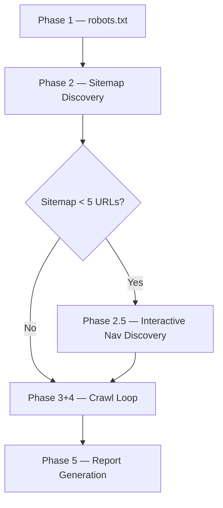
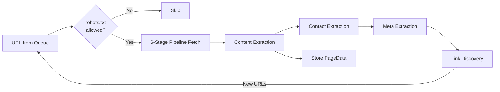

# Universal Web Crawler — System Walkthrough

A complete guide to the features and functionalities of the Universal Web Crawler from A to Z.

---

## 1. What It Does

The Universal Web Crawler takes a **single URL** (a website homepage) and automatically:

- Discovers every page on the website through sitemaps, link-following, and interactive navigation menus
- Fetches each page using a 6-stage fallback pipeline (browser → proxy → plain HTTP)
- Extracts structured content: text, headings, images, videos, tables, lists
- Finds contact information: emails, phone numbers, addresses, social media links
- Captures SEO metadata: title, description, Open Graph tags, JSON-LD structured data
- Generates a comprehensive report in both Markdown and JSON formats

---

## 2. Project Structure

```
Crawler/
├── main.py                    # CLI entry point
├── config.py                  # PipelineConfig + CrawlerConfig settings
├── models.py                  # Data models: CrawlResponse, PageData, WebsiteReport
├── pipeline.py                # 6-stage fallback fetch pipeline
│
├── crawler/                   # Orchestration
│   ├── orchestrator.py        # Main crawl loop — 5 phases
│   ├── url_queue.py           # Priority queue with dedup + scope limits
│   └── checkpoint.py          # Save/resume interrupted crawls
│
├── discovery/                 # URL discovery
│   ├── robots_parser.py       # robots.txt parsing + crawl permission checks
│   ├── sitemap_parser.py      # Sitemap XML parsing (standard, WordPress, gzipped)
│   ├── link_extractor.py      # 4-strategy link extraction from crawled pages
│   ├── nav_discovery.py       # Playwright-based interactive SPA navigation discovery
│   └── url_utils.py           # URL normalization, domain checks, exclusion filters
│
├── extraction/                # Content extraction
│   ├── content_extractor.py   # HTML → structured PageData extractor
│   ├── contact_extractor.py   # Email, phone, address, social link extraction
│   ├── meta_extractor.py      # SEO metadata + JSON-LD extraction
│   └── job_extractor.py       # Legacy IT job classifier (--mode jobs)
│
├── stages/                    # Pipeline fetch stages
│   ├── stage_crawl4ai.py      # Stage 1: Headless Chromium via Crawl4AI
│   ├── stage_scrapling.py     # Stage 2: Scrapling browser automation
│   ├── stage_jina.py          # Stage 3: Jina Reader API proxy
│   ├── stage_curl_tls.py      # Stage 4: curl_cffi TLS fingerprinting
│   ├── stage_curl_rotated.py  # Stage 5: curl_cffi browser profile rotation
│   └── stage_httpx.py         # Stage 6: Plain httpx HTTP client
│
└── output/                    # Report generation
    ├── markdown_report.py     # Markdown report builder
    └── json_export.py         # JSON data export
```

---

## 3. The 5 Crawl Phases

The orchestrator runs 5 sequential phases for every crawl:



### Phase 1 — robots.txt

- Fetches `https://domain.com/robots.txt` using async HTTP
- Parses `Disallow` rules via Python's built-in `RobotFileParser`
- Extracts `Sitemap:` directives for use in Phase 2
- Reads `Crawl-delay:` and enforces it if higher than the configured delay
- If robots.txt is absent or returns a non-200 status → all paths are treated as allowed

### Phase 2 — Sitemap Discovery

Tries 6 common sitemap paths:
- `/sitemap.xml`
- `/sitemap_index.xml`
- `/wp-sitemap.xml`
- `/sitemap/sitemap-index.xml`
- `/page-sitemap.xml`
- `/post-sitemap.xml`

Plus any `Sitemap:` URLs extracted from robots.txt.

**Capabilities:**
- Handles **sitemap index files** — recursively follows child sitemaps
- Handles **gzipped sitemaps** (`.xml.gz`)
- Parses the standard `sitemaps.org` XML namespace correctly
- All discovered URLs are seeded into the crawl queue with high priority

### Phase 2.5 — Interactive Navigation Discovery (SPA Sites)

> Activates automatically when Phase 2 finds fewer than 5 URLs, which typically indicates a JavaScript SPA with no sitemap.

Standard HTML parsers find zero internal links on sites where navigation is built with JavaScript `<button>` elements (e.g., Next.js with Radix UI Menubar) because there are no `<a href>` tags for internal pages.

**How it works:**

1. Launches a real headless Chromium browser via Playwright
2. Finds all interactive menu trigger buttons using selectors:
   - `button[role="menuitem"]`
   - `[data-slot="menubar-trigger"]`
   - `nav button[aria-haspopup="menu"]`
   - `header button[aria-haspopup="menu"]`
3. Sends a real pointer **hover** event to each trigger — this is what opens React/Radix UI dropdowns (JavaScript `dispatchEvent` does not work because React uses synthetic event handlers)
4. Reads all visible dropdown item texts
5. For each item: navigates back to homepage → re-hovers the trigger → finds the item by text → clicks it → captures the URL the browser lands on
6. Also collects any `<a href>` links that appear in the rendered page at any stage

All discovered URLs are added to the crawl queue at `depth=1`.

### Phase 3+4 — Crawl Loop

The main crawl loop processes URLs from the queue until one of these stop conditions is met:
- Queue is empty
- `max_pages` limit is reached
- `max_time_minutes` budget is exhausted

**Per-URL processing:**



**Concurrency and rate limiting:**
- `asyncio.Semaphore` limits parallel fetches (configurable, default 3)
- Enforced delay between requests (configurable, default 1.5s)
- Checkpoint saved every N pages (configurable, default every 25)

### Phase 5 — Report Generation

Aggregates all `PageData` objects into a single `WebsiteReport`:
- Deduplicates emails, phones, and social links across all pages
- Sums word counts and image counts
- Groups pages by crawl depth for the site structure view
- Uses the homepage title and language as site-level metadata
- Writes `report.md` and `data.json` to `./output/{domain}/`

---

## 4. The 6-Stage Fallback Pipeline

Each URL is fetched through up to 6 stages. The **first stage that succeeds wins**. If all stages fail, the URL is recorded in the failed URLs list.

| Stage | Method | Strength |
|-------|--------|----------|
| **1 — Crawl4AI** | Headless Chromium (Playwright), waits for `networkidle` | JavaScript-rendered SPAs, React/Next.js |
| **2 — Scrapling** | Browser automation | Sites that detect and block basic headless browsers |
| **3 — Jina Reader** | `r.jina.ai` API proxy | Cloudflare-protected sites |
| **4 — curl_cffi TLS** | TLS fingerprint impersonation (Chrome 120 profile) | Bot-detection bypassing |
| **5 — curl_cffi Rotated** | Rotates across Chrome, Firefox, Safari, Edge profiles with retries | Heavy anti-bot protection |
| **6 — httpx Plain** | Standard HTTP/2 client | Simple static sites, last resort |

**What each stage returns:**
- `html` — raw page HTML
- `markdown` — Crawl4AI/Jina rendered markdown
- `text` — plain text content
- `status_code` — HTTP response code
- `stage_name` — which stage succeeded
- `attempts` — full diagnostic log of all attempted stages

Each stage can be individually enabled or disabled via `PipelineConfig`.

---

## 5. Link Discovery — 4 Strategies

Run on every crawled page to find new URLs to add to the queue:

| Strategy | What It Scans | Designed For |
|----------|--------------|-------------|
| **1 — HTML `<a href>`** | All anchor tags in parsed HTML | Standard HTML websites |
| **2 — SPA data attributes** | `data-href`, `data-url`, `data-route`, `data-link` on any element | Next.js, React Router, Angular |
| **3 — Markdown `[text](url)`** | Crawl4AI's rendered markdown output | Links embedded in JS-rendered content |
| **4 — Bare URL fallback** | Raw `https://...` URLs in plain text | Last resort, activates when strategies 1–3 find fewer than 3 links |

All discovered URLs pass through URL normalization before entering the queue:
- Lowercase scheme and hostname
- Strip URL fragments (`#section`)
- Strip tracking query parameters (`utm_*`, `fbclid`, `gclid`, `ref`, etc.)
- Filter excluded file extensions (images, PDFs, archives, media, CSS, JS, fonts)
- Filter non-HTTP schemes (`mailto:`, `tel:`, `javascript:`, `data:`)
- Classify as internal (same domain/subdomain) vs external

---

## 6. Content Extraction

Parses the HTML of each crawled page into a structured `PageData` object:

| Field | Source |
|-------|--------|
| `page_title` | `<title>` tag |
| `headings` | All `<h1>` through `<h6>` tags, grouped by level |
| `paragraphs` | All `<p>` tags with content longer than 20 characters |
| `lists` | `<ul>` and `<ol>` elements with 2 or more items |
| `tables` | `<table>` elements → `{headers: [...], rows: [[...]]}` |
| `images` | `` and `data-src` (lazy-loaded), with `alt` and `title`. Tracking pixels (≤ 2px) are filtered out |
| `videos` | `<iframe>` YouTube/Vimeo/Wistia embeds + `<video>` and `<source>` tags |
| `raw_text` | All visible text with `<script>`, `<style>`, `<noscript>`, and `<svg>` stripped |
| `word_count` | Whitespace-split count of `raw_text` |

---

## 7. Contact Extraction

### Emails
- Regex match on both raw text and HTML source
- Filters known junk domains: `example.com`, `sentry.io`, `schema.org`, `googleapis.com`, etc.

### Phone Numbers (Strict Strategy)
Two-layer approach to prevent false positives from CSS class names, image filenames, and dates:

1. **`tel:` links** — `<a href="tel:+911234567890">` (highest confidence, explicit declaration)
2. **Strict regex on visible text only** — matches only:
   - International format with `+` prefix (e.g., `+91 8128780878`)
   - Parenthesized area code format (e.g., `(123) 456-7890`)
   - Scans `raw_text` only — never the HTML source — to avoid matching CSS IDs and numeric paths

### Addresses
- Extracts text from HTML `<address>` semantic tags

### Social Media Links
Pattern-matched from HTML for 7 platforms:

| Platform | Pattern |
|----------|---------|
| Twitter / X | `twitter.com/` or `x.com/` |
| LinkedIn | `linkedin.com/company/` or `linkedin.com/in/` |
| Facebook | `facebook.com/` |
| Instagram | `instagram.com/` |
| YouTube | `youtube.com/c/`, `youtube.com/channel/`, `youtube.com/@` |
| GitHub | `github.com/` |
| TikTok | `tiktok.com/@` |

---

## 8. SEO / Meta Extraction

Extracted from every page's `<head>` section:

| Field | Source |
|-------|--------|
| `page_title` | `<title>` tag |
| `meta_description` | `<meta name="description">` |
| `meta_keywords` | `<meta name="keywords">` |
| `og_title` | `<meta property="og:title">` |
| `og_image` | `<meta property="og:image">` |
| `canonical_url` | `<link rel="canonical">` |
| `language` | `<html lang="...">` attribute |
| `structured_data` | All `<script type="application/ld+json">` blocks, parsed as JSON objects |

---

## 9. URL Queue System

An async priority queue managing all URLs to be crawled:

- **Deduplication** — normalized URL set prevents re-crawling the same page
- **Priority ordering** (lower = crawled sooner):
  - `0` = Homepage
  - `1` = Top-level pages (e.g., `/about`, `/contact`)
  - `2` = Second-level pages
  - `3` = Deep pages
- **Depth enforcement** — URLs beyond `max_depth` are silently rejected
- **Page budget** — URLs beyond `max_pages` are silently rejected
- **Stats tracking** — counts of seen, pending, completed, and rejected URLs

---

## 10. Checkpoint System

Automatically saves crawl state to `crawl_state.json` every N pages (default: 25):

- All completed `PageData` objects
- Full set of seen URLs for deduplication on resume
- List of failed URLs with error details
- Crawl configuration snapshot (base URL, domain, start time)

**Atomic writes** — state is written to a `.tmp` file first, then renamed to prevent data corruption if the process is killed mid-write.

**Resume** — the `--resume` flag loads the checkpoint, restores the URL queue, and continues from where it left off without re-crawling already-completed pages.

**Cleanup** — the checkpoint file is automatically deleted when the crawl finishes successfully.

---

## 11. Output Formats

Both files are written to `./output/{domain}/` after each crawl.

### `report.md` — Human-Readable Markdown Report

| Section | Contents |
|---------|----------|
| **Website Overview** | Domain, total pages, word count, image count, crawl start/end times |
| **Contact Information** | All emails, phone numbers, addresses, social media links aggregated across the site |
| **Site Structure** | All crawled pages grouped by depth level |
| **Page Details** | Per-page: URL, word count, headings, content preview, contact info found, meta description |
| **All Pages Index** | Full table of every page with title, URL, words, images, depth |
| **Failed URLs** | Pages that all 6 pipeline stages failed to fetch, with error messages |
| **External Links** | All outbound links discovered across the site |

### `data.json` — Machine-Readable JSON

Full serialization of the `WebsiteReport` dataclass:
- Every field from every `PageData` (all extracted content, all metadata, all links)
- Site-level aggregates (emails, phones, social media, external links)
- Crawl statistics and timing
- Failed URL list with errors

---

## 12. CLI Flags

```
python main.py <url> [options]

Universal Crawl Options:
  --max-pages N       Maximum pages to crawl (default: 200)
  --max-depth N       Maximum link-follow depth from homepage (default: 5)
  --max-time N        Time budget in minutes (default: 30)
  --delay N           Delay between requests in seconds (default: 1.5)
  --concurrent N      Max concurrent page fetches (default: 3)
  --no-robots         Ignore robots.txt restrictions
  --resume            Resume from a saved checkpoint
  --output DIR        Output directory for reports (default: ./output)
  --format FORMAT     Output formats: markdown, json, or both (default: both)

Global Options:
  --timeout N         Per-page fetch timeout in seconds (default: 30)
  --verbose / -v      Enable debug-level logging

Legacy Job Crawl Mode:
  --mode jobs         Switch to IT job crawler mode
  --all-jobs          Include non-IT roles in job output
  --disable-browser   Disable browser-based pipeline stages
  --disable-jina      Disable the Jina Reader proxy stage
  --jina-key KEY      Jina API key for higher rate limits
  --jobs-output FMT   Output format: text or json (default: text)
```

---

## 13. Configuration Parameters

### CrawlerConfig — Orchestrator Level

| Parameter | Default | Description |
|-----------|---------|-------------|
| `max_pages` | 200 | Hard cap on total pages to crawl |
| `max_depth` | 5 | Maximum link-follow depth from the homepage |
| `max_time_minutes` | 30 | Total time budget for the crawl |
| `request_delay` | 1.5s | Minimum seconds between page requests |
| `max_concurrent` | 3 | Maximum simultaneous page fetches |
| `respect_robots` | True | Obey `robots.txt` Disallow and Crawl-delay rules |
| `checkpoint_every` | 25 | Save crawl state every N completed pages |
| `checkpoint_file` | `crawl_state.json` | Checkpoint file path |
| `output_dir` | `./output` | Directory for generated reports |
| `output_formats` | `[markdown, json]` | Which report formats to generate |

### PipelineConfig — Stage Level

| Parameter | Default | Description |
|-----------|---------|-------------|
| `timeout` | 30s | Per-stage page fetch timeout |
| `min_content_length` | 200 | Minimum character count to accept a response as valid |
| `enable_crawl4ai` | True | Enable/disable Stage 1 |
| `enable_scrapling` | True | Enable/disable Stage 2 |
| `enable_jina` | True | Enable/disable Stage 3 |
| `enable_curl_tls` | True | Enable/disable Stage 4 |
| `enable_curl_rotated` | True | Enable/disable Stage 5 |
| `enable_httpx` | True | Enable/disable Stage 6 |
| `crawl4ai_headless` | True | Run browser in headless mode |
| `curl_impersonate` | `chrome120` | TLS fingerprint profile for Stages 4–5 |

---

## 14. Data Models

### PageData — One crawled page

```
url                 — Normalized page URL
page_title          — <title> tag content
crawled_at          — ISO timestamp
depth               — Link depth from homepage

headings            — {h1: [...], h2: [...], ...}
paragraphs          — [str, ...]
lists               — [[item, item, ...], ...]
tables              — [{headers: [...], rows: [[...]]}, ...]

images              — [{src, alt, title}, ...]
videos              — [embed_url, ...]

internal_links      — [normalized_url, ...]
external_links      — [url, ...]

emails              — [str, ...]
phones              — [str, ...]
addresses           — [str, ...]
social_links        — {platform: url, ...}

meta_description    — str
meta_keywords       — str
og_title            — str
og_image            — str
canonical_url       — str
language            — str
structured_data     — [{JSON-LD object}, ...]

raw_text            — str
word_count          — int
fetch_stage         — which pipeline stage fetched this page
```

### WebsiteReport — Full crawl result

```
domain              — Base domain (e.g., aperions.com)
base_url            — Starting URL
site_title          — Homepage <title>
language            — Homepage language attribute

crawl_started       — ISO timestamp
crawl_finished      — ISO timestamp

total_urls_found    — Total unique URLs discovered
total_pages_crawled — Successfully fetched pages
failed_pages        — Pages where all 6 stages failed
total_words         — Sum of word counts across all pages
total_images        — Sum of images across all pages

pages               — [PageData, ...]

all_emails          — Deduplicated list across all pages
all_phones          — Deduplicated list across all pages
all_addresses       — Deduplicated list across all pages
social_media        — {platform: url, ...}

failed_urls         — [{url, error, depth}, ...]
external_links      — Deduplicated list across all pages
```

---

## 15. Dependencies

| Package | Purpose |
|---------|---------|
| `crawl4ai ≥ 0.8.0` | Stage 1: headless browser rendering via Playwright/Chromium |
| `scrapling ≥ 0.2.99` | Stage 2: alternative browser automation |
| `httpx[http2] ≥ 0.28.1` | Stage 6, robots.txt fetching, sitemap fetching |
| `curl-cffi ≥ 0.14.0` | Stages 4–5: TLS fingerprint impersonation |
| `beautifulsoup4 ≥ 4.14.3` | HTML parsing in all extraction modules |
| `lxml ≥ 5.4.0` | Fast HTML/XML parsing + sitemap XML parsing |
| `playwright` | SPA interactive navigation discovery (installed via crawl4ai) |
| `rich ≥ 13.0` | Console output formatting |

---

*Universal Web Crawler — Feature & Functionality Reference*
